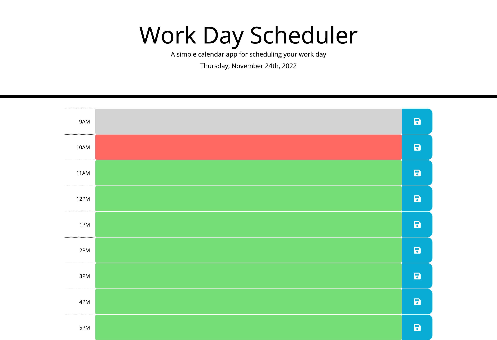

# 05-Challenge-Work-Day-Scheduler

## Description

The 05-Challenge Work Day Scheduler involved creating a simple calendar where HTML and CSS are powered by jQuery.

The work day calendar display the current date at the top of the page using moment.js. The timeblocks are color coded to represent past, present, and future hours. The user is able to type a description in the text areas between the time and save button. When the user clicks the save button, the description typed in the text area is saved in local storage. When the user refreshes the page, the description persists and is still displayed until local storage is cleared by the user.

## Mock Up

The following image shows the Work Day Scheduler appearance and functionality:

## Link

https://swaguespack.github.io/04-Challenge/